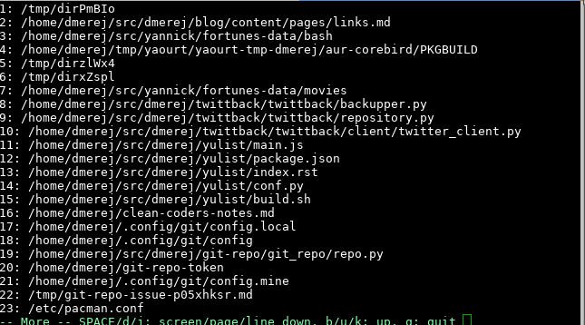

# fzf For The Win!

---

# But first, an alternate definition of duck-typing

---

# Duck typing

> Si t'as une vache avec un bec qui fait coin-coin, et ben tu peux
> l'utiliser comme un canard.

---

# En images

---

# Plan

* Je vous montre plein de commandes que j'utilisais avant
* Puis je vous montre comment j'ai tout remplacé par `fzf`
* Avec des démos entre les deux

---

# Avant fzf

---

# find

    !bash
    $ find . -name "*foo*"
    # ou
    $ find . -iname "*foo*"

---

# Naviguer dans l'historique zsh

* `CTRL-R`

* Appuyer sur la flèche du haut

        !bash
        bindkey '^[[A' history-beginning-search-backward
        bindkey '^[[B' history-beginning-search-forward

        $ ssh <flèche haut>
        # Cherche toutes les commandes commençant par `ssh`

* Quand ça veut pas

        !bash
        $ grep 'something' ~/.zshhistory
        # ou même
        $ vi ~/.zshhistory
        # et puis `:saveas my_script.sh`

---

# Lister les buffers dans vim

    !vim
    :ls
    " puis
    :buffer <number>
    " ou
    :buffer foo<TAB>

---

# Naviguer dans l'historique vim

    !vim
    :oldfiles
    " ou
    :browse oldfiles

---

# Visiter les répertoires déjà fréquentés

* autojump
* z
* ...

        !bash
        $ cd ~/a/long/path/to/foo
        # '~/a/long/path/to/foo' est inséré dans une base de donnée
        $ cd ~/an/other/path/to/bar
        # même chose pour ~/an/other/path/to/bar
        $ z foo
        # change pour le chemin de foo

---

# Cherchons le pattern

---

# Similarités

Dans tous les cas on a une liste dans laquelle on voudrait sélectionner un
résultat *et un seul*

Dans la plupart des cas, les listes sont plus ou moins triées.

Et en général on veut ne taper qu'un bout de ce qu'on cherche, et pas s'embêter
avec la casse.

---

# Problèmes

Chacun des outils présenté a sa propre façon de faire.

Et en plus, chacun a des côtés pénibles

---

# find

Extrait de mon historique zsh:

    !bash
    $ find -name *foo*
    # Oups, faut mettre un point avant
    $ find . -name *foo*
    # Oups, faut échapper les étoiles:
    $ find . -name "*foo*"
    # Oups, je voulais `-iname` en pas `-name`
    $ find . -iname "*foo*"

---

# L'historique zsh

Jamais réussi à le faire marcher sur plusieurs distros en même temps ...

Une fois qu'on a tapé `CTRL-R` on ne voit qu'un choix à la fois, et c'est
pas pratique.

---

# `:list`, `:buffer`

`:list` affiche des infos utiles
(par example, le fichier 'alternate', qu'on peut éditer avec
`:b#`)

`:buffer` et la complétion marchent bien, sauf quand on bosse avec plein de
`index.js` dans plein de répertoires différents ...

---

# `:oldfiles`

`:oldfiles` sert pas à grand chose en soi.

Il faut en plus se taper le "Press enter to continue, q to quit ..."

Et `:browse oldfiles` c'est long à taper.

Pas de recherche possible no plus :/

---

# `z`, `autojump`

L'heuristique essaye de deviner le répertoire dans lequel vous voulez aller.

Mais quand c'est ambigu ça marche pas bien.

(Et c'est très frustrant)

    !bash
    z foo
    # /path/to/foo
    z foobar
    # /path/to/foobar

---

# fzf

---

# Fait un truc et le fait bien

    !bash
    cat myliste.txt | fzf

Affiche tout le contenu de `maliste.txt`, et permet de sélectionner
rapidement le bon choix.

Pas besoin de taper *exactement* un bout de ligne: c'est ça la partie
"fuzzy"

Plein d'infos dans `man fzf` aussi!

---

# Installation

    !bash
    git clone --depth 1 https://github.com/junegunn/fzf.git ~/.fzf
    ~/.fzf/install

C'est du `Go` donc:

* Ça marche partout
* Ça a pas de dépendances
* C'est **rapide**

---

# Démo 1

Fonctionnement basique de `fzf`

---

# En asynchrone c'est mieux

Quand la liste est très grande, `fzf` permet quand même de sélectionner
*tout en continuant à alimenter la liste originale*

---

# Démo 2

---

# fzf de base

---

# Historique

* Vous pouvez dire à `fzf` de se lancer quand vous faites 'CTRL-R'

* Comme moi, vous pouvez aussi dire à fzf de se lancer quand vous faites
  flèche-haut:

        !zsh
        bindkey '^[[A' fzf-history-widget

---

# Naviguer dans les répertoires

De même, fzf peut vous lister les sous-répertoires, et vous y
emmener après appui sur `<ALT-C>`.

Après sélection d'un des sous-répertoires, et appui sur entrée,
`fzf` vous y emmènera comme si vous aviez fait `cd sous/répertoire`

---

# Remplacer find (1)

Lister les fichiers d'un répertoire (récursivement)

`CTRL-T` par défaut:

Du coup vous pouvez faire:

      $ vim <ctrl-t>

Et quand vous aurez sélectionné le bon fichier dans fzf vous avez
juste à appuyer sur entrée pour l'ouvrir dans vim.

---

# Remplacer find (2)

Quand on veut éxecuter *une* commande sur *un fichier* particulier et qu'on
connaît à peu près son nom, `fzf` est très bien.

Dans les autres cas:

* Pour lancer une commande avec plusieurs fichiers, on peut faire:

    !bash
    $ ma-commande **/*.txt

* Et si on veut lancer `ma-commande` une fois pour chaque fichier:

    ! bash
    $ find . -name *.txt | xargs -n1 ma-commande

(C'est l'option `-n` de `xargs`, peu connue)

---

# Dans vim

`fzf.vim` est un plug-in qui enrichit le plug-in vim installé par défaut avec `fzf`

Il fournit des commandes "clé en main" comme `:Buffers`, `:History`, ou
`:GitFiles`.

Après installation, il suffit de configurer vos raccourcis:

    !vim
    nnoremap <leader>p :History<CR>
    nnoremap <leader>b :Buffers<CR>
    nnoremap <leader>t :Files<CR>

---

# fzf.vim

Permet aussi de créer vos propres commandes avec un peu de `vimscript`:

    !vim

    function SelectSomething()
    call fzf#run({
        \ 'source': "my-cmd",
        \ 'sink': ":DoSomething"
        \})
    endfunction

    command! -nargs=0 SelectSomething :call SelectSomething()

Ici, on va lancer `my-cmd` pour alimenter la liste `fzf`, puis
passer le résultat à `:DoSomething`

---

# Remplacer autojump / z

---

# Disclaimer

En vrai ça on peut utiliser fzf et z ensemble: plus d'infos dans le
[wiki fzf](https://github.com/junegunn/fzf/wiki/examples#z)

Dans la suite je vais montrer comment j'ai réimplémenté `z` from scratch.
(Parce que c'est rigolo)

---

# Stocker une liste de chemins

Dans `~/.local/share/zsh/cwd.json`:

    !json
    {
      "/path/to/foo": 2,
      "/path/to/foo/src": 3,
      "/path/to/bar": 1
    }

---

# Un petit bout de Python

Un petit bout de Python/argparse pour implémenter:

* `cwd add CHEMIN`: Incrémente le compteur pour le chemin donné
* `cwd edit`
* `cwd clean` (Supprime les répertoires qui n'existent plus)
* `cwd list` Pour lister les chemins dans l'ordre

 

<small>Vous avez le droit d'utiliser des langages/libraries moins bien si vous
préférez</small>

---

# Se hooker dans zsh

Pas compliqué:

    !bash
    function register_cwd() {
        cwd-history add "$(pwd)"
    }
    typeset -gaU register_cwd
    chpwd_functions+=register_cwd

Ici `register_cwd` sera appelée à chaque fois que `zsh` change de répertoire
courant.

---

# Dernière étape

Et du coup on a tout ce qui faut pour ré-implémenter `z`
complètement:

    !bash
    function z() {
      cwd_list=$(cwd-history list)
      if [[ -n $1 ]]; then
        cwd_list=$(echo $cwd_list | grep --ignore-case $1)
      fi
      ret="$(echo $cwd_list| fzf --tac)"
      cd "${ret}"
      if [[ $? -ne 0 ]]; then
        cwd-history remove "${ret}"
      fi
    }

---

# Un dernier truc cool

----

# Du shell vers l'éditeur et vice-versa

On peut aussi partager des infos entre vim et le shell.

---

# De neovim vers le shell

Dans `~/.vimrc`:

    !vim
    " Write cwd when leaving
    function! WriteCWD()
    call writefile([getcwd()], "/tmp/nvim-cwd")
    endfunction

    autocmd VimLeave * silent call WriteCWD()

Dans `~/.zshrc`:

    !bash
    " Change working dir after neovim exits
    function vim {
      neovim $*
      if [[ $? -eq 0 ]]; then
          cd "$(cat /tmp/nvim-cwd 2>/dev/null || echo .)"
      fi
    }

Oui, c'est pas très propre :P

---

# Du shell vers neovim

On peut aussi aller dans l'autre sens:

    !vim
    function ListWorkingDirs()
    call fzf#run({
            \ 'source': "cwd-history list",
            \ 'sink': "cd"
            \})
    endfunction

    command! -nargs=0 ListWorkingDirs :call ListWorkingDirs()
    nnoremap <leader>l :ListWorkingDirs<CR>

---

# Une démo pour finir

---

# Gardons le contact

* Forkez cette présentation [sur github](
  https://github.com/dmerejkowsky/fzf-ftw)
* Mon site: [https://dmerej.info](https://dmerej.info)
* Mon article de blog sur le sujet: [fzf for the win](https://dmerej.info/blog/post/fzf-for-the-win/)
* Mastodon: `@dmerej@mamot.fr`
* IRC: `dmerejkowsky` sur `freenode` et `irc.mozilla.org`
* Twitter: `@d_merej`
